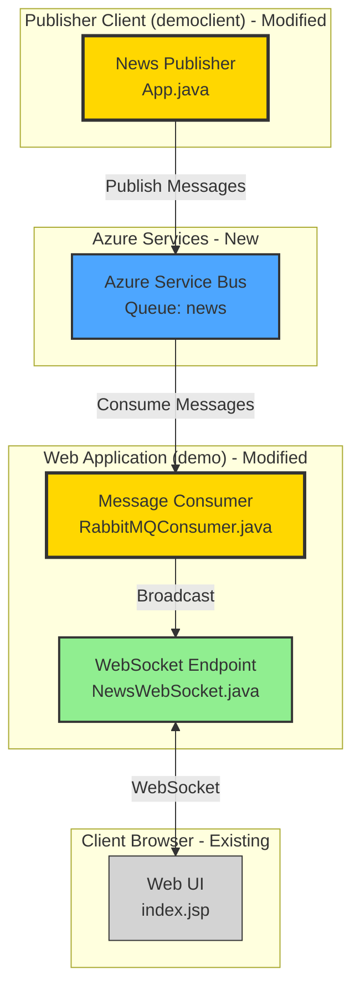

# Modernization Plan: Migrate RabbitMQ to Azure Service Bus

**Project**: RabbitMQ News Feed Demo  
**Date**: December 12, 2025  
**Branch**: 001-migrate-rabbitmq-to-azure-service-bus

---

## Technical Framework

- **Language**: Java 8
- **Framework**: Servlet 3.1, WebSocket API 1.1
- **Build Tool**: Maven 3.x
- **Messaging**: RabbitMQ AMQP Client 5.16.0
- **Key Dependencies**: javax.websocket-api, javax.servlet-api, rabbitmq amqp-client

---

## Overview

This migration replaces RabbitMQ messaging with Azure Service Bus for the news feed application. The application currently uses RabbitMQ to queue news messages from a publisher client and consume them in a web application that broadcasts to WebSocket clients. The new architecture will:

- Replace RabbitMQ connection and channel management with Azure Service Bus client
- Migrate message publishing from RabbitMQ producer to Azure Service Bus sender
- Migrate message consumption from RabbitMQ consumer to Azure Service Bus receiver
- Maintain the existing WebSocket broadcasting functionality without changes
- Preserve all existing business logic and message flow patterns

The migration follows a component-by-component approach, updating both the producer (democlient) and consumer (demo) modules to use Azure Service Bus while maintaining functional equivalence.

---

## Services

### Azure Service Bus
- **Resource ID**: to be provisioned
- **Namespace**: to be configured
- **Queue Name**: news (matching existing RabbitMQ queue)
- **Authentication**: Connection string or Managed Identity
- **Purpose**: Replace RabbitMQ for message queuing between publisher client and web application

---

## Architecture Design

**Legend**:
- 🟢 **Green**: Unchanged components (WebSocket broadcasting logic)
- 🟡 **Yellow**: Existing components to be modified (RabbitMQ client code)
- 🔵 **Blue**: Azure services (Azure Service Bus)
- **Gray**: Existing client components

---

## Code

### Task 01: Migrate Message Producer to Azure Service Bus

**Description**: Replace RabbitMQ message publishing in the democlient module with Azure Service Bus message sending to enable news message publishing through Azure cloud messaging.

**Requirements**: 
- Migrate the RabbitMQ producer client (democlient/src/main/java/com/example/App.java) to use Azure Service Bus
- Maintain the same message publishing functionality and user interaction flow
- Preserve the command-line interface for entering news messages

**Environment Configuration**: 
- Azure Service Bus connection string or Managed Identity configuration
- Service Bus namespace and queue name configuration

**Task Execution**: .github/modernization/001-migrate-rabbitmq-to-azure-service-bus/task-01-migrate-producer/task.md

**Referenced Skills**: 
- .appmod-kit/custom/skills/rabbitmq-to-azureservicebus

**Success Criteria**:
- Pass Build: Yes - Project must compile successfully after migration
- Generate New Unit Tests (Mock-based): Yes - Create mock-based unit tests for Azure Service Bus sender code
- Generate New Integration Tests: No - Integration tests not required for this task
- Pass Unit Tests: Yes - All unit tests must pass with mocked Azure Service Bus dependencies
- Pass New Integration Tests: No - Integration tests not required for this task
- Security Compliance: No - CVE scanning not required for this task

---

### Task 02: Migrate Message Consumer to Azure Service Bus

**Description**: Replace RabbitMQ message consumption in the demo web application with Azure Service Bus message receiving to enable processing of news messages from Azure cloud messaging.

**Requirements**:
- Migrate the RabbitMQ consumer (demo/src/main/java/com/example/rabbitmq/RabbitMQConsumer.java) to use Azure Service Bus
- Maintain the same message consumption and WebSocket broadcasting functionality
- Preserve the ServletContextListener lifecycle integration

**Environment Configuration**:
- Azure Service Bus connection string or Managed Identity configuration
- Service Bus namespace and queue name configuration

**Task Execution**: .github/modernization/001-migrate-rabbitmq-to-azure-service-bus/task-02-migrate-consumer/task.md

**Referenced Skills**: 
- .appmod-kit/custom/skills/rabbitmq-to-azureservicebus

**Success Criteria**:
- Pass Build: Yes - Project must compile successfully after migration
- Generate New Unit Tests (Mock-based): Yes - Create mock-based unit tests for Azure Service Bus receiver code
- Generate New Integration Tests: No - Integration tests not required for this task
- Pass Unit Tests: Yes - All unit tests must pass with mocked Azure Service Bus dependencies
- Pass New Integration Tests: No - Integration tests not required for this task
- Security Compliance: No - CVE scanning not required for this task

---

## Clarifications

The following items were not explicitly requested but may be needed for a complete implementation:

1. **Azure Service Bus Tier Selection**: 
   - **Why needed**: Different Azure Service Bus tiers (Basic, Standard, Premium) offer different features and pricing
   - **Options**: 
     - Basic: Simple queue-based messaging
     - Standard: Includes topics/subscriptions and larger message sizes
     - Premium: Dedicated resources, higher throughput, geo-disaster recovery
   - **Recommendation**: Standard tier for development/testing; can be upgraded to Premium for production if needed

2. **Authentication Method**:
   - **Why needed**: Azure Service Bus supports multiple authentication methods
   - **Options**:
     - Connection String: Simpler setup, suitable for development
     - Managed Identity: More secure, recommended for production Azure deployments
     - Service Principal: Alternative for service-to-service authentication
   - **Recommendation**: Start with Connection String for easier local development; migrate to Managed Identity for production deployment

3. **Error Handling and Retry Strategy**:
   - **Why needed**: Azure Service Bus may have transient failures that require retry logic
   - **Options**:
     - Use Azure SDK built-in retry policies
     - Implement custom retry logic
     - Configure dead-letter queues for failed messages
   - **Recommendation**: Use Azure SDK default retry policies initially; add dead-letter queue configuration for production robustness

4. **Configuration Management**:
   - **Why needed**: Service Bus connection strings and queue names need to be externalized
   - **Options**:
     - Environment variables
     - Configuration files (application.properties)
     - Azure Key Vault for sensitive credentials
   - **Recommendation**: Use environment variables for local development; migrate to Azure Key Vault for production secrets management
