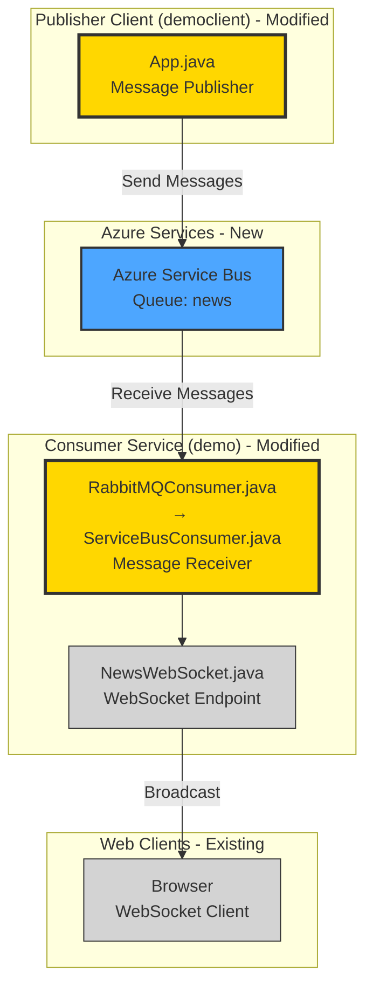

# Modernization Plan: Migrate RabbitMQ to Azure Service Bus

**Project**: RabbitMQ News Feed Demo  
**Date**: December 15, 2025  
**Branch**: 002-migrate-rabbitmq-to-azure-service-bus

---

## Technical Framework

- **Language**: Java 1.8
- **Framework**: Java Servlet 3.1, WebSocket API 1.1
- **Build Tool**: Maven 3.x
- **Message Broker**: RabbitMQ 3.x with AMQP client 5.16.0
- **Web Server**: Jetty (via maven plugin)
- **Key Dependencies**: RabbitMQ AMQP Client, Javax WebSocket API, Javax Servlet API, Gson 2.8.9

---

## Overview

This migration replaces RabbitMQ message broker with Azure Service Bus. The application currently uses RabbitMQ to enable real-time news publishing where a publisher client (democlient) sends news messages to a queue, and a consumer service (demo) receives these messages and broadcasts them to web clients via WebSocket connections. The new architecture will:

- Replace RabbitMQ queue-based messaging with Azure Service Bus queues for more scalable cloud-native messaging
- Maintain the same message flow pattern: publisher → queue → consumer → WebSocket broadcast
- Preserve the existing WebSocket functionality for real-time browser notifications
- Enable cloud-based deployment without requiring self-hosted message broker infrastructure

The migration follows a phased approach: first migrating the consumer service, then the publisher client, ensuring both components can communicate through Azure Service Bus while maintaining backward compatibility during transition.

---

## Architecture Design

**Legend**:
- 🟡 **Yellow**: Existing components to be modified (RabbitMQ → Azure Service Bus)
- 🔵 **Blue**: Azure services (new)
- **Gray**: Unchanged components (WebSocket infrastructure)

---

## Code

### Task 1: Migrate Consumer Service from RabbitMQ to Azure Service Bus

**Description**: Migrate the consumer service (demo) to receive messages from Azure Service Bus instead of RabbitMQ, maintaining the WebSocket broadcast functionality for real-time browser notifications.

**Requirements**:
- Migrate RabbitMQConsumer.java to use Azure Service Bus SDK
- Preserve the existing message delivery pattern: receive from queue → broadcast to WebSocket clients
- Maintain servlet context lifecycle integration (start on contextInitialized, cleanup on contextDestroyed)
- Preserve all logging and error handling behaviors

**Environment Configuration**:
_Not specified - will use default Azure Service Bus connection configuration_

**Task Execution**: .github/modernization/002-migrate-rabbitmq-to-azure-service-bus/task-01-consumer-migration/task.md

**Referenced Skills**: 
- .appmod-kit/custom/skills/rabbitmq-to-azureservicebus

**Success Criteria**:
- Pass Build: Yes - Project must compile successfully after migration
- Generate New Unit Tests (Mock-based): Yes - Create mock-based unit tests for Azure Service Bus integration code
- Generate New Integration Tests: No - Integration tests not required unless Azure Service Bus resources are provided
- Pass Unit Tests: Yes - All tests must pass with mocked Azure Service Bus clients
- Pass New Integration Tests: No - Integration tests will only be run if Azure resources are accessible
- Security Compliance: No - CVE scanning not required for this migration

---

### Task 2: Migrate Publisher Client from RabbitMQ to Azure Service Bus

**Description**: Migrate the publisher client (democlient) to send messages to Azure Service Bus instead of RabbitMQ, maintaining the command-line interface for news message publishing.

**Requirements**:
- Migrate App.java to use Azure Service Bus SDK for message publishing
- Preserve the existing command-line interface (read input, publish messages, exit on "exit"/"quit")
- Maintain the same queue name and message format for compatibility
- Preserve all logging and error handling behaviors

**Environment Configuration**:
_Not specified - will use default Azure Service Bus connection configuration_

**Task Execution**: .github/modernization/002-migrate-rabbitmq-to-azure-service-bus/task-02-publisher-migration/task.md

**Referenced Skills**: 
- .appmod-kit/custom/skills/rabbitmq-to-azureservicebus

**Success Criteria**:
- Pass Build: Yes - Project must compile successfully after migration
- Generate New Unit Tests (Mock-based): Yes - Create mock-based unit tests for Azure Service Bus integration code
- Generate New Integration Tests: No - Integration tests not required unless Azure Service Bus resources are provided
- Pass Unit Tests: Yes - All tests must pass with mocked Azure Service Bus clients
- Pass New Integration Tests: No - Integration tests will only be run if Azure resources are accessible
- Security Compliance: No - CVE scanning not required for this migration

---
