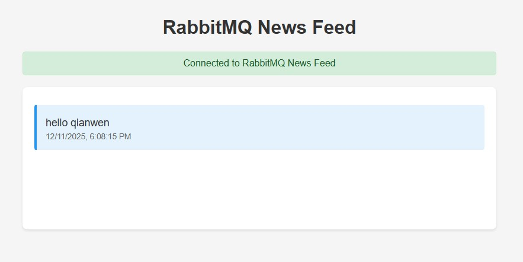

# RabbitMQ News Feed Demo

1. start rabitmq
```
docker run -d --name rabbitmq -p 5672:5672 -p 15672:15672 rabbitmq:3-management
```

2. start demo service
```
cd demo
mvn clean jetty:run
```
Open portal: http://localhost:8080/demo/

3. start democlient
```
cd democlient
mvn clean package
mvn exec:java "-Dexec.mainClass=com.example.App"
```
Enter message: hello

Portal shows the received message:


